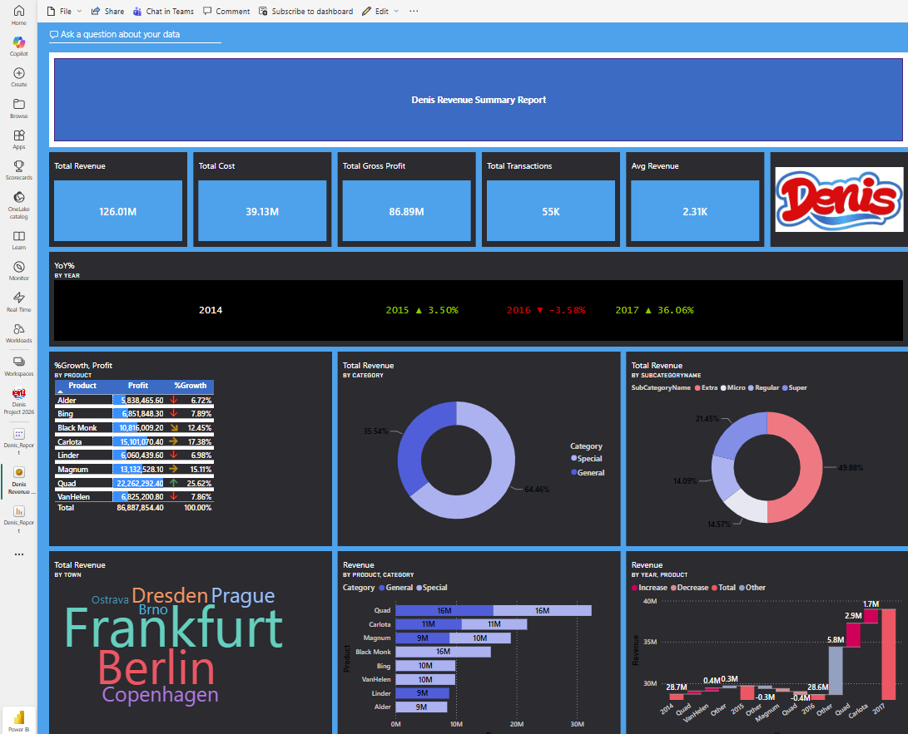
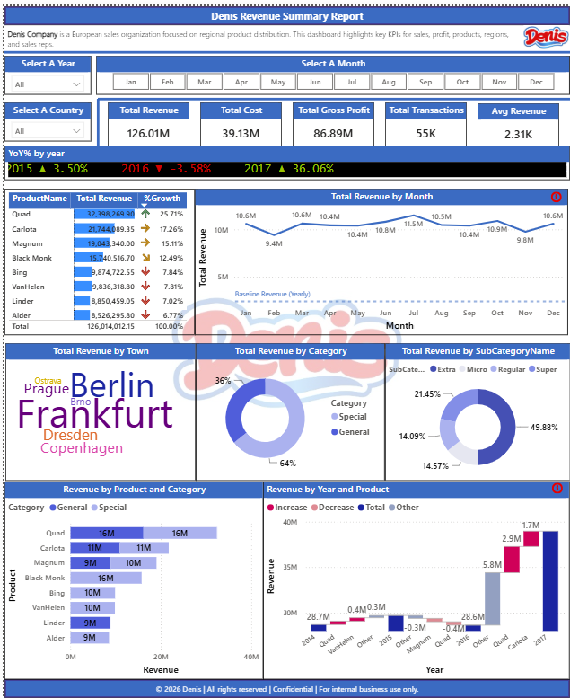
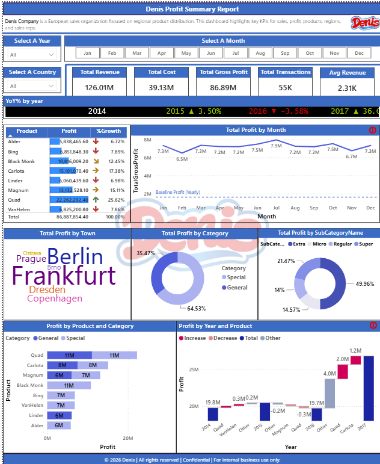
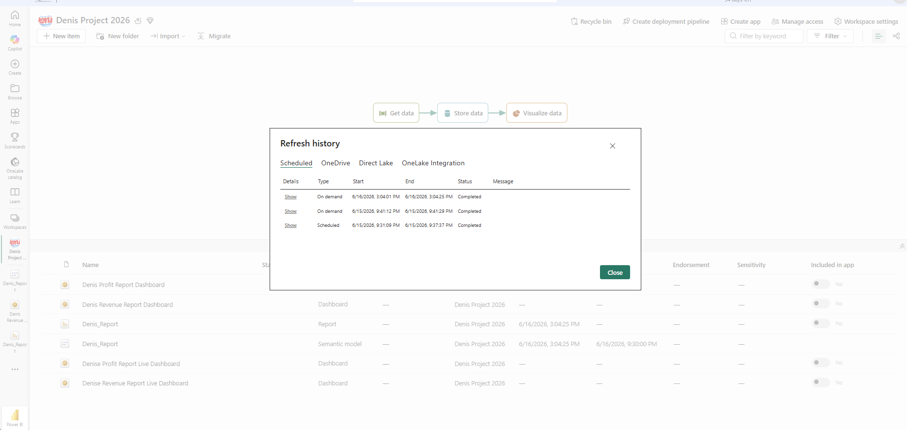

# Denis Sales BI — End-to-End Power BI Project

> **European retail sales intelligence platform** built with Power BI Desktop, DAX, dynamic RLS, and automated scheduled refresh via on-premises gateway.

📄 **[View Full Report (PDF)](Denis_Report.pdf)**  
📁 **[GitHub Repository](https://github.com/cijubnair-design/Denis-Sales-BI-2026)** ← *(update after pushing)*

---

## Business Context

**Denis Company** is a European sales organization focused on regional product distribution across 7 cities in Germany, Czech Republic, and Denmark. Management needed visibility into revenue trends, gross profit by product and category, and year-over-year growth — previously tracked manually in spreadsheets with no consistent reporting structure.

---

## Solution Overview

Built a complete end-to-end Power BI solution:

- Designed a **star schema data model** connecting sales transactions, products, dates, and regions
- Built **15+ DAX measures** including YoY%, CALCULATE, time intelligence, and dynamic RLS
- Created **3 interactive report pages** (Summary, Revenue Report, Profit Report) with cross-filtering
- Implemented **Row Level Security (RLS)** by location using USERPRINCIPALNAME() and an access lookup table
- Configured **scheduled daily refresh** via on-premises data gateway (Ciju_KSR_Early_Bird)
- Published to **Power BI Service** with a live dashboard pinning key KPIs

---

## Key Metrics (2014–2017)

| KPI | Value |
|-----|-------|
| Total Revenue | 126.01M |
| Total Cost | 39.13M |
| Total Gross Profit | 86.89M |
| Total Transactions | 55K |
| Avg Revenue per Transaction | 2.31K |
| Best YoY Growth Year | 2017 (+36.06%) |
| Top Product by Profit Growth | Quad (+25.62%) |
| Dominant Category | General (64.53% of profit) |

---

## Tech Stack

| Component | Technology |
|-----------|------------|
| Data Modeling | Power BI Desktop — Star Schema |
| Data Transformation | Power Query (M Language) |
| Business Logic | DAX — 15+ measures |
| Security | Row Level Security (Static + Dynamic) |
| Publishing | Power BI Service |
| Automation | On-premises Data Gateway — Daily Scheduled Refresh |
| Source Data | CSV files (Denis_G.csv, Access_Table.csv) |

---

## Report Pages

### 1. Summary Report
Top-level KPI cards + YoY% trend chart by year + product profit growth table with conditional formatting indicators.

### 2. Revenue Report
Revenue breakdown by town (word cloud), category (donut), subcategory (donut), product, and monthly trend line with baseline comparison.

### 3. Profit Report
Profit by product and category (bar chart), profit by year and product (waterfall chart), and geographic distribution.

---

## Screenshots

### Dashboard Overview


### Revenue Report


### Profit Report


### Data Model


### Scheduled Refresh — Completed Successfully


---

## DAX Highlights

See full measures in [Dax/key_measures.md](Dax/key_measures.md)

**Sample — YoY% Calculation:**
```dax
YoY% = 
VAR CurrentYearProfit = [Total Gross Profit]
VAR PreviousYearProfit = 
    CALCULATE(
        [Total Gross Profit],
        SAMEPERIODLASTYEAR(DateMaster[Date])
    )
RETURN
    DIVIDE(CurrentYearProfit - PreviousYearProfit, PreviousYearProfit)
```

**Sample — Dynamic RLS:**
```dax
// Access filter on Location dimension
[Location_Access] = "All" ||
[Location_Access] = 
    LOOKUPVALUE(
        Access_Table[Location_Access],
        Access_Table[Username], USERPRINCIPALNAME()
    )
```

---

## Row Level Security

Implemented two-layer RLS:
- **Static RLS** — role-based filter by city/region
- **Dynamic RLS** — USERPRINCIPALNAME() looks up the logged-in user's access level from Access_Table.csv
- Users assigned "All" see the full dataset; users assigned a specific location (e.g., "Germany") see only their region's data
- Tested in Power BI Service using "View as role" feature

---

## Scheduled Refresh Setup

- **Gateway:** On-premises data gateway (Ciju_KSR_Early_Bird) — running on local machine
- **Connections:** Denis_G.csv + Access_Table.csv mapped to gateway
- **Schedule:** Daily at 9:30 PM ET
- **Status:** First scheduled refresh completed successfully 6/15/2026

---

## Key Insights

1. **2017 was the breakout year** — YoY growth of +36.06% driven by Quad and Carlota product lines
2. **2016 was the only down year** — YoY -3.58%, primarily in VanHelen and Magnum segments
3. **Quad dominates profitability** — highest profit at 22M+ with 25.62% growth rate
4. **General category drives the business** — 64.53% of total profit vs 35.47% for Special
5. **Frankfurt and Berlin** are the highest-profit cities by significant margin
6. **Super subcategory** leads at 49.96% of subcategory profit

---

## Project Files

```
Denis-Sales-BI-2026/
├── README.md
├── Screenshots/
│   ├── 01_Dashboard.png
│   ├── 02_Revenue_report.png
│   ├── 03_Profit_report.png
│   ├── 04_Data_model.png
│   └── 05_Refresh_history.png
├── Dax/
│   └── key_measures.md
└── Data/
    └── data-sources.md
```

> **Note:** Source data files are not included in this repository as they contain proprietary business data. The data model structure and transformation logic are documented in this README and the DAX measures file.

---

## Skills Demonstrated

`Power BI Desktop` `Power BI Service` `DAX` `Power Query` `M Language` `Star Schema` `Data Modeling` `Row Level Security` `Time Intelligence` `On-premises Gateway` `Scheduled Refresh` `Dashboard Design` `KPI Reporting` `Conditional Formatting`

---

*Project completed as part of KSR Vision Data Analytics Master Class — June 2026*  
*© 2026 Denis | All rights reserved | Confidential | For internal business use only*
